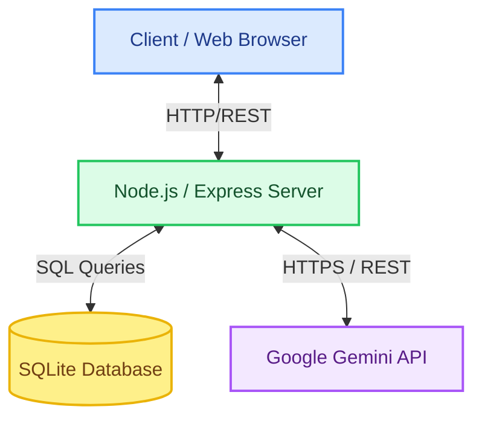
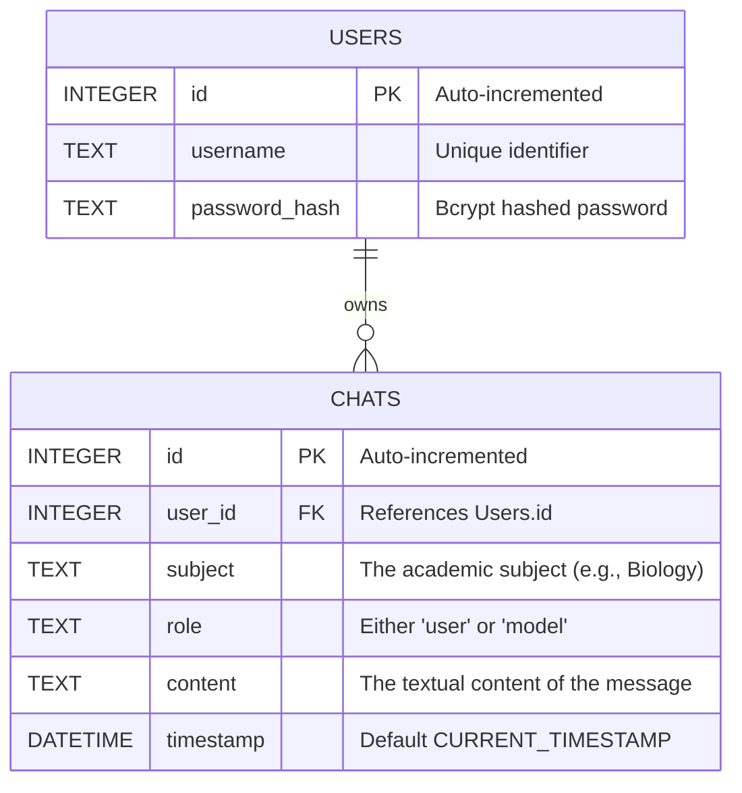
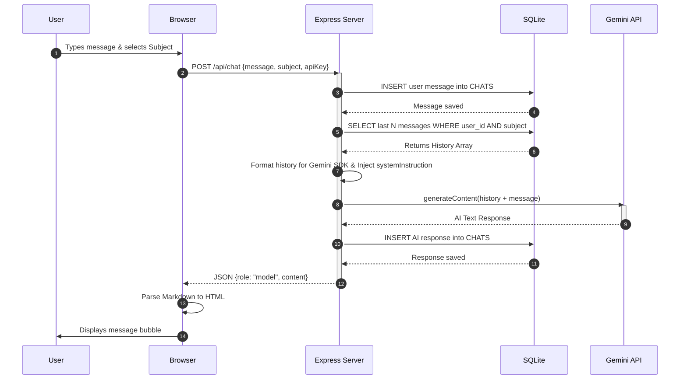

# EduBot - System Design Document

## 1. Introduction
**EduBot** is a web-based, AI-powered educational chatbot designed to act as a personalized tutor for students. It allows users to interact with an AI expert in various academic subjects (e.g., Computer Science, Mathematics, Biology). The system retains context by saving chat history locally and dynamically injects subject-specific personas into the AI model. 

This document outlines the architecture, data models, and detailed workflows of the application.

---

## 2. Technology Stack
* **Frontend:** HTML, EJS (Embedded JavaScript templating), Tailwind CSS (for styling), Vanilla JavaScript (for interactivity).
* **Backend:** Node.js, Express.js.
* **Database:** SQLite (Relational, file-based database for zero-config persistence).
* **AI Integration:** `@google/genai` (Google Gemini 2.5 Flash API).
* **Security & Auth:** `bcrypt` (password hashing), `express-session` (session management).

---

## 3. High-Level Architecture
The application follows a monolithic client-server architecture. The frontend sends HTTP requests to the Node.js Server, which acts as the orchestrator connecting the SQLite database (for state persistence) and the Google Gemini API (for AI generation).

---

## 4. Database Schema
EduBot employs a simple relational schema to manage users and their conversational histories. 

* **USERS Table:** Handles authentication. Passwords are never stored in plaintext.
* **CHATS Table:** Acts as the persistent memory state. By filtering by `user_id` and `subject`, the system can retrieve isolated, domain-specific conversation histories.

---

## 5. System Components & Workflows

### 5.1 Authentication Flow
1. User provides `username` and `password`.
2. Server hashes the password using `bcrypt` (for registration) or compares hashes (for login).
3. On success, an `express-session` is instantiated, and a session cookie is returned to the client.

### 5.2 Core Interaction: The Chat Flow
The most critical workflow is how the application handles user prompts, injects context, and returns AI responses.

---

## 6. Key Design Decisions

1. **Client-Side API Key Storage:** 
   To maintain privacy and reduce server costs/liabilities, the Gemini API key is required from the user. It is stored in the browser's `localStorage` and sent with every chat request. The backend does **not** persist API keys.
   
2. **Dynamic Context Windows:** 
   To prevent the AI from losing track of the conversation, the server limits context retrieval to the last 20 messages. This ensures high relevance while preventing token overload.

3. **System Instructions (Personas):** 
   By dynamically modifying the `systemInstruction` in the Gemini configuration (`"You are an expert <subject> tutor..."`), the AI's behavior, tone, and knowledge boundaries are strictly scoped to the user's current academic focus.

4. **Server-Side Rendering (SSR) via EJS:**
   Instead of an SPA (Single Page Application) framework like React, EduBot uses EJS. This reduces the client-side bundle size, eliminates the need for complex API routing for initial page loads, and provides a highly performant initial paint.

---

## 7. Future Enhancements
* **WebSockets/Server-Sent Events:** Implementing streaming responses so the user sees the AI typing character-by-character.
* **Vector Database Retrieval (RAG):** Allowing users to upload PDF textbooks and giving the AI access to specific chapters using semantic search.
* **Authentication OAuth:** Adding options to "Login with Google/GitHub".
